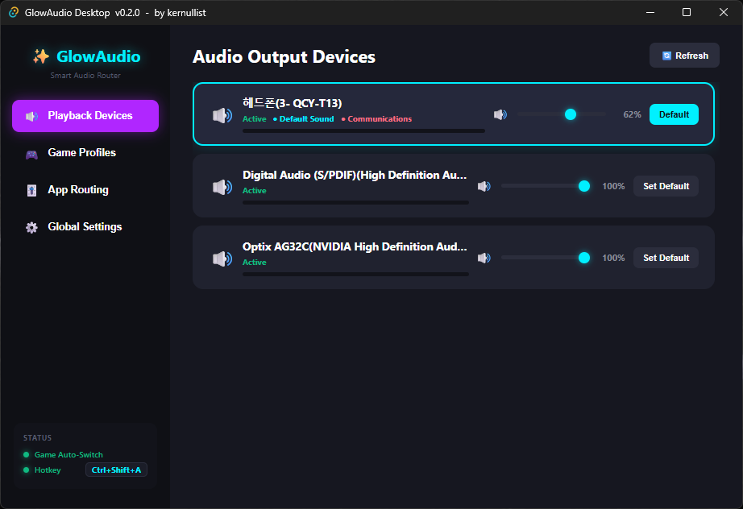
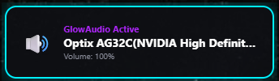

# ✨ GlowAudio Desktop (Tauri Edition) 🎧

**English** · [한국어](README.ko.md)

[](https://github.com/kernullist/glow-audio/actions/workflows/ci.yml)

> **A neon audio utility that controls real Windows playback devices directly, auto-switches on game launch, and offers a global-hotkey HUD — a Tauri v2 + React + Rust reimplementation.**

This is a Tauri-based native desktop rebuild of an earlier Python (CustomTkinter) prototype.
Instead of Python/pycaw, the audio backend **calls WASAPI / Core Audio COM directly from Rust via the `windows` crate**,
while the UI reproduces the same cyberpunk neon / glassmorphism design in React + TypeScript.

## 🖼️ Screenshots



Floating HUD overlay shown on a device switch:



---

## 🌟 Features

1. **Real Windows audio control** — enumerate render devices with `IMMDeviceEnumerator`, volume/mute via
   `IAudioEndpointVolume`, and switch the default device for both the Console and Communications roles through the
   undocumented COM interface `IPolicyConfig::SetDefaultEndpoint`.
2. **Live peak meters** — poll `IAudioMeterInformation` every 100 ms and visualize it as a neon gradient bar on each device card.
3. **Global background hotkey** — register an OS-level shortcut (default `Ctrl+Shift+A`) with
   `tauri-plugin-global-shortcut` to cycle the active device and show the HUD without stealing focus.
4. **Game auto-routing engine** — a `sysinfo`-based background thread scans processes every 2 seconds and
   auto-switches to the mapped device when a registered game launches.
5. **Floating HUD overlay** — a borderless, transparent, always-on-top window that fades in/out at the bottom-right.
6. **Per-app audio routing (v2)** — send individual apps (Chrome, Discord, games) to different output devices *simultaneously* via the undocumented `IAudioPolicyConfigFactory`, resolved per audio-session PID. Falls back gracefully to default-device switching on builds that don't support it.
7. **Per-app volume control** — adjust each app's volume/mute (`ISimpleAudioVolume`) like the Windows Volume Mixer; "remember" an app to auto-restore its level the next time it launches. Apps that stopped playing stay listed as **idle** for a configurable timeout (browsers release their audio stream when idle, and a disconnecting Bluetooth endpoint drops every session bound to it), so a row never vanishes mid-adjustment — changes made while idle are saved and applied on next playback.
8. **Start with Windows** — optional autostart toggle in Global Settings; autostarted instances launch quietly into the tray. The tray menu also offers one-click device cycling.
9. **File logging** — runtime logs go to the OS app-log directory (`tauri-plugin-log`), so issues in release builds are diagnosable.

---

## 📂 Structure

```
glow-audio/
├─ src/                     # React + TypeScript frontend
│  ├─ App.tsx               # Main UI (Devices / Profiles / Routing / Volume / Settings)
│  ├─ Hud.tsx               # Floating HUD overlay component
│  ├─ api.ts                # Typed wrappers around the Rust commands
│  ├─ main.tsx              # Routes main vs HUD via the ?view=hud query
│  └─ styles.css            # Neon / glassmorphism theme
└─ src-tauri/               # Rust backend
   └─ src/
      ├─ audio.rs           # WASAPI/COM audio engine + IPolicyConfig definition
      ├─ audio_router.rs    # v2 per-session routing (IAudioPolicyConfigFactory)
      ├─ audio_volume.rs    # Per-app volume control (ISimpleAudioVolume)
      ├─ monitor.rs         # Process monitor + auto-routing thread
      └─ lib.rs             # Commands, global hotkey, HUD, routing worker, persistence
```

Settings and profiles are stored in the OS app-config directory
(`%APPDATA%\com.kernullist.glowaudio\`) as `glow_settings.json` / `glow_profiles.json`.

---

## 🚀 Development / Build

### Prerequisites
- Node.js + npm
- Rust (stable, MSVC target) + Visual Studio C++ Build Tools
- WebView2 runtime (bundled with Windows 11)

### Commands
```powershell
npm install            # frontend dependencies
npm run tauri dev      # dev mode (HMR + Rust hot-rebuild)
npm run tauri build    # release build (standalone exe + installers)
```

> ⚠️ During development, always launch with `npm run tauri dev`. Running the debug exe
> (`src-tauri/target/debug/glow-audio.exe`) on its own fails to reach the Vite dev server
> (localhost:1420) and shows a connection-refused page. To get a double-clickable standalone
> executable, build it with `tauri build` (see the script below).

### Build script (`build.ps1`)
A PowerShell script that handles the cargo PATH, checks prerequisites, and prints the produced artifact paths.
```powershell
.\build.ps1              # full build: standalone exe + installers (msi/nsis)
.\build.ps1 -NoBundle    # standalone exe only (skip installers, faster)
.\build.ps1 -SkipInstall # skip npm install
```
Artifacts:
- Standalone exe: `src-tauri/target/release/glow-audio.exe`
- Installers: `src-tauri/target/release/bundle/{msi,nsis}/`

npm aliases are also available: `npm run app:build` (full), `npm run app:exe` (exe only), `npm run app:dev` (dev).

### Hotkey
- Default global hotkey: **`Ctrl+Shift+A`** — cycle the active device + show the HUD popup.
- Changeable in the `Global Settings` tab using a format like `Ctrl+Alt+S` (modifier + key, joined by `+`).
